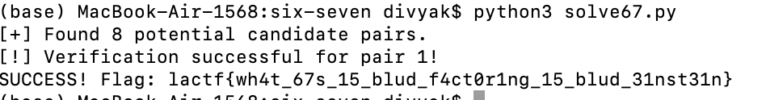

## Context

The challenge instance first asks for a Proof of Work to make spamming the server with a bot more computationally expensive. An example of a Proof of Work is below:
curl -sSfL https://pwn.red/pow | sh -s s.AAA6mA==.Z5r08nzVnvLrMznfnkqH2A==
Once you solve this, you are given 2 numbers for the values of n and c and the instance is closed.
The hint given in the challenge is that, first, it is in the cryptography category and that it uses RSA encryption. Second, as the challenge name suggests, the primes for the RSA encryption follow the pattern `[67]*`. 

The challenge also provides the source code `chall.py` which gives an insight as to how the primes are generated and that they are of length 256 digits, and that e = 65537. 

## Vulnerability

Normally, RSA is quite hard to solve. In its typical implementation, the primes, p and q, are roughly 1024 bits each. p x q creates n, the modulus. The original text's ascii numbers are used to numerically convert the text into a number, m. e, which is typically 65537, is used then to create the ciphertext,c, with `c=m^e (mod n)`. e and d are modular inverses, so having d would allow us to recover the original message, m. 
In traditional, secure RSA, this is nearly impossible to do, as finding d requires the prime factors of n, which should be unfeasible due to how large n is. 

However, given the fact that we are given the hint of how the primes are generated, the search space of 256-digit primes goes from `10^256` to `2^256`, which makes the primes easier to determine, which ultimately breaks the underlying mechanism of the security behind RSA.

## Exploitation

The file `solve67.py` contains the python script written to solve the challenge. We realize we don't even need to iterate through the entire `2^256` large search space of potential primes, but rather go digit by digit.
 It begins with the realization that a prime number must be odd and is comprised of 6s and 7s only. Thus, the final digit of each prime must be 7, which aligns with the fact that every n generated ended in 9. Given the limited search space, we can actually go digit by digit, from left to right. 
Thus, we start with the two numbers 7,7 as our primes and continue to build them going right to left with a loop. In the loop, we look at the last i + 1 digits each time, and add 6 or 7 to the front of the thus-far-valid p and qs. We then try multiplying the new test p and test q, to see if it matches the last i+1 digits. If so, we keep it as a pair for the next part of the loop.
Thus, we build out the primes p and q. We multiply them a final time to ensure their product is n.  We also ensure that once we have built out the entire numbers p and q that they are, indeed, primes. We use the primes to calculate the totient, phi, which we then use to calculate d, using its relationship as a modular inverse of relative to phi. We then use d to decrypt the cyphertext, as `m = c^d (mod n)`.  Finally, we convert it to bytes and decode it to find the flag.

## Remediation

The most immediate remediation technique would be not to use a pattern to generate primes like `[67]*`, and especially do not make said pattern publically known, as this allowed us to iterate through a small, finite range of primes to determine p and q.

Instead, RSA primes should be generated by using CSPRNs, Cryptographically Secure Pseudo-Random Number Generators; primes should be picked from the entire available bit-space rather than a restricted set of digits.
