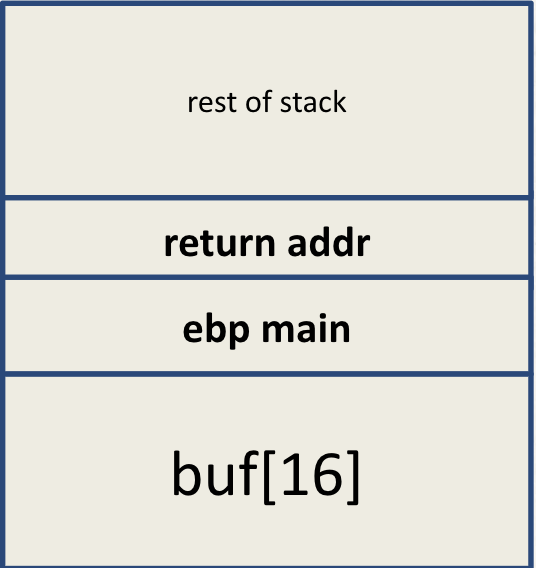

## Context

ROPfu is a binary exploitation challenge whose name is a nod to Return-Oriented Programming (ROP), a technique where instead of injecting your own code, you chain together small sequences of existing instructions in the binary, each ending in a `ret`, to accomplish arbitrary code execution. However, we do not end up chaining together ROP gadgets in the challenge due to the discovery of another primitive, an executable stack.

The challenge provides a binary and source code. Connecting to the instance gives you a shell prompt to interact with.

## Vulnerability

The vulnerability is the use of `gets()` in the `vuln()` function. `gets()` reads input into a fixed-size buffer with no bounds checking, meaning it will write as many bytes as you send regardless of how large the buffer actually is. This allows us to overflow past `buf`, overwrite the saved EBP (Base Pointer, the register that marks the bottom of the current stack frame), and ultimately overwrite the return address, giving us control over where the program executes next.

What makes this challenge different from a standard ret2win is the absence of a `win()` function. There is no helpful function to redirect execution to. Instead, `checksec` reveals that the stack is executable, meaning bytes written to the stack can be treated as instructions by the CPU. This introduces a new primitive: shellcode injection. Rather than jumping to existing code, we can write our own machine code directly onto the stack and execute it.

## Exploitation




Running `objdump` on the binary reveals that `buf` lives at `EBP - 0x18`, meaning it starts 24 bytes below EBP. Combined with the 4 bytes of saved EBP, the offset to the return address is 28 bytes. See Diagram 1 for the clean stack layout before the exploit.

The goal is to inject shellcode that calls `execve("/bin/sh", NULL, NULL)` via `int 0x80`, a direct syscall to the OS to spawn a shell. Since the stack is executable, bytes we write there will run as instructions once EIP (Instruction Pointer, the register that tells the CPU which instruction to execute next) points to them.

We build the payload in three parts, following the order shown in Diagram 2.

**Step 1 — overwrite the return address with a `jmp eax` gadget.** We need a way to redirect EIP into buf, where our instructions will live. `gets()` conveniently returns the address of `buf` in EAX (the register that holds return values of functions), so at the moment `ret` fires EAX is already pointing at the start of buf. We find a `jmp eax` gadget in the binary using `ROPgadget`:

```bash
ROPgadget --binary ./ropfu | grep "jmp eax"
```

This gives us `0x0805333b`. We use 28 bytes of padding (24 for buf + 4 for saved EBP) to reach the return address slot and overwrite it with this gadget address.

**Step 2 — place `\xFF\xE4` at the start of buf.** After `ret` fires and `jmp eax` executes, EIP lands at the very start of buf. We need it to immediately jump to ESP (Stack Pointer, the register that tracks the top of the current stack frame), which after `ret` points directly above the return address where our shellcode is sitting. Since no `jmp esp` gadget exists in the binary, we place `\xFF\xE4`, the raw bytes that the CPU interprets as the `jmp esp` instruction, at the very beginning of buf. EIP hits them immediately and jumps to ESP.

**Step 3 — place shellcode above the return address.** This is where ESP points after `ret` fires. We put our `execve("/bin/sh")` shellcode here so that when `jmp esp` executes, the CPU runs it directly and spawns a shell.

The final payload can be found in `payload.py`. Running it spawns a shell on the picoctf challenge server, giving us access to `flag.txt`!
i
## Remediation

The most immediate fix is replacing `gets()` with an alternative like `fgets(buf, sizeof(buf), stdin)`, which limits input to the actual buffer size and eliminates the overflow entirely.

Beyond that, enabling NX (marking the stack as non-executable) would prevent shellcode injection as a technique entirely, even if an overflow exists. With NX enabled, bytes written to the stack cannot be executed, forcing an attacker to rely on existing code in the binary rather than injecting their own. Modern compilers often enable NX by default, and its absence here is what made shellcode injection possible in the first place.
